# COMP3133 Fullstack Labtest

## Real-time Chat App

This is a real-time chat application where users can sign up, log in, join group chats, send messages, and leave groups. Below is a step-by-step guide to how the app works.

---

### Welcome Page

The welcome page contains two buttons:
- **Login**
- **Sign Up**

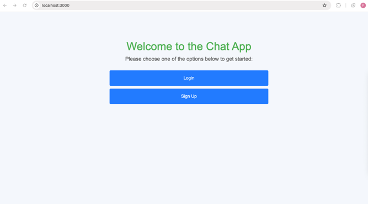

---

### Signup

Users can sign up by entering their **Username**, **First Name**, **Last Name**, and **Password**. After filling in the required fields, click **Register**. There is also a link at the bottom that redirects users back to the login page if they already have an account.

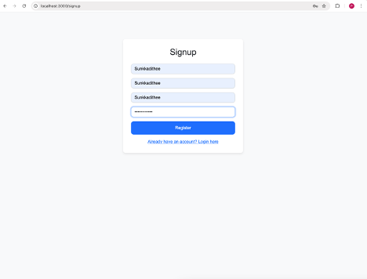

Once the registration is successful, a notification will pop up confirming the account creation.

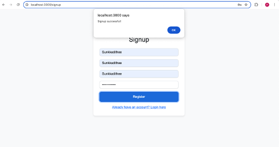

Here’s the database showing the newly created user:

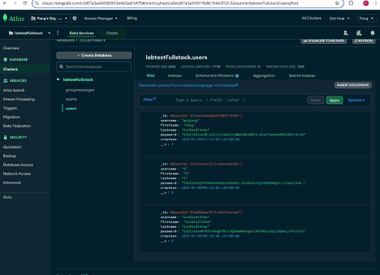

---

### Login

Users can log in by entering their **Username** and **Password**.

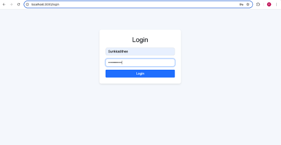

---

### Join Chat Page

After logging in, users are directed to the homepage, where they can join group chats. There are three available group chat options:
1. **General**
2. **Tech**
3. **Gaming**

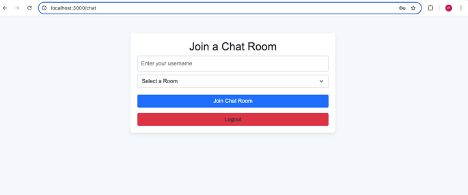

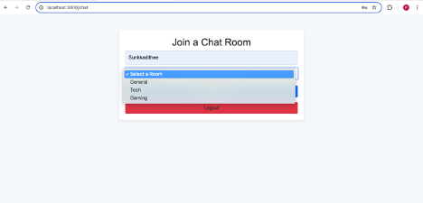

Here’s the database showing the available rooms:

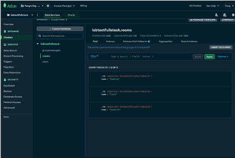

---

### Chat Room - Group Messages

In the chat room, users can see the room name and the members currently joined. Since only one user (myself) is in the room, you will see only my name. Users can type messages into the chat box, and these messages will be saved to the database.

Here are some screenshots of the group messages:

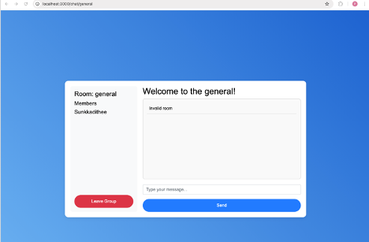

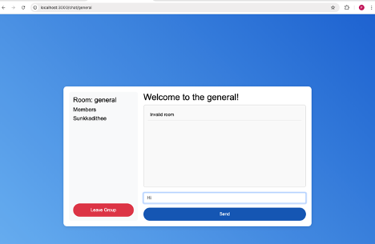

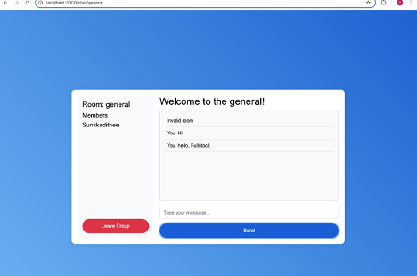

The database stores the **Username**, **Room**, **Message**, and **Timestamp** of each chat message.

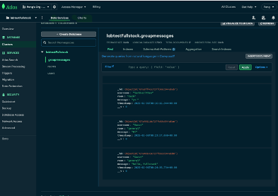

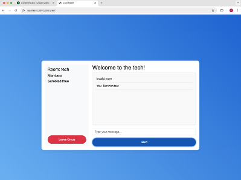

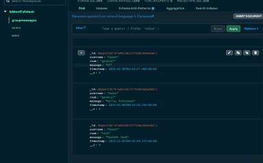

---

### Leave Group

Users have the option to leave a group. When you click **Leave Group**, you will be redirected back to the Join Room page.

---

### Log Out

In the Join Room page, there is a **Log Out** option for users. Clicking this will log the user out and take them back to the Welcome page.

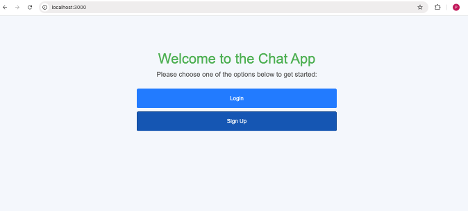

---

This README provides a detailed guide on how the real-time chat application works. Users can sign up, log in, join chat rooms, send messages, and manage their accounts with ease. Enjoy exploring the app!
